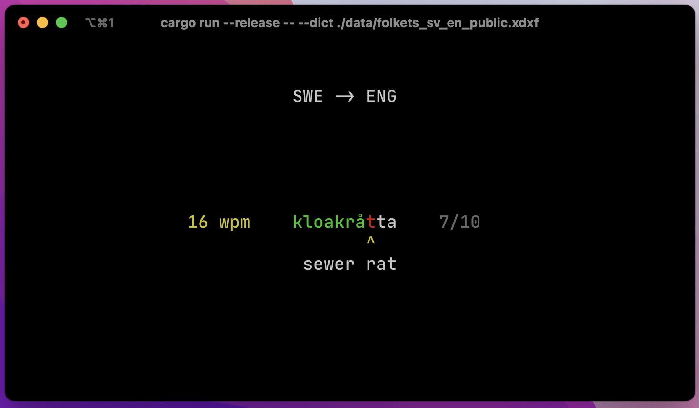
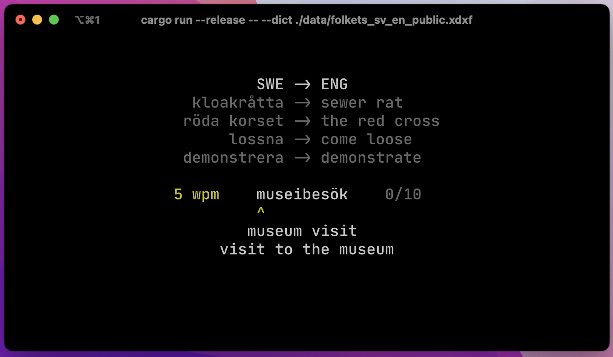
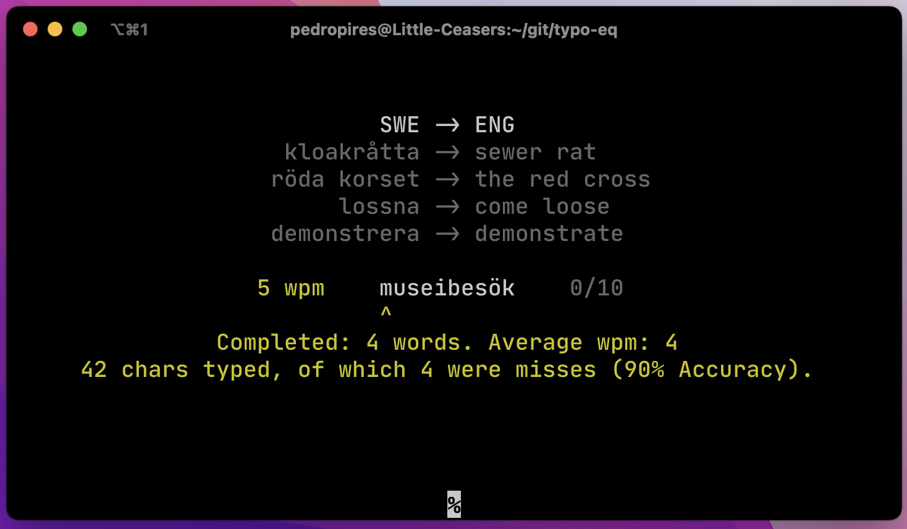

# Typo-eq

Typo-eq is a typing training app for other languages. All it needs is a 
dictionary for words and their translations.

Currently this app **only supports xdxf** dictionary files, so be sure to 
download one for the language you want. I recomend the Swedish-English 
dictinary available at https://folkets-lexikon.csc.kth.se/folkets/om.en.html.

To start the application, make sure you have `rust` installed and put your
dictionary data somewhere accessible to the app. Then run the following
command in your terminal.

```sh
cargo run -- --dict path/to/xdxf/file
```

A short loading screen should appear as your dictionary is loaded. Bigger 
dictionaries typically take longer (_obvio_), the Svenska-English dictionary
from the Swedish People's Dictionary takes around 1.32 seconds.

## Screenshots



